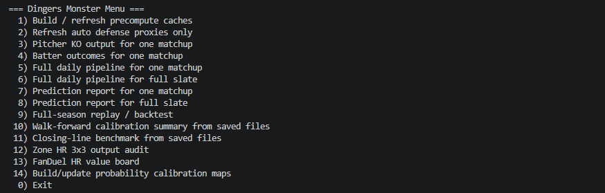
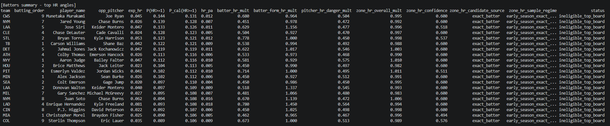
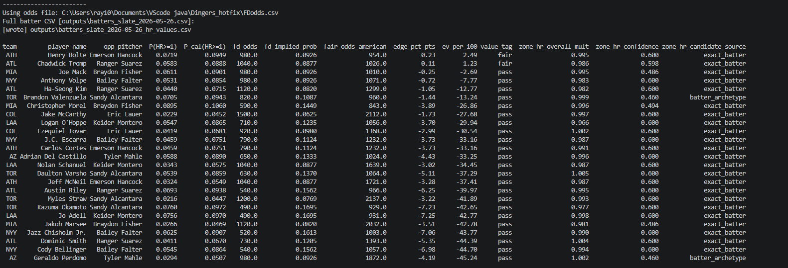

# MLB Dingers Prediction Model

This project is an MLB analytics and prediction engine designed to estimate pitcher strikeouts, batter outcomes, home run probability, and home run value opportunities using player data, matchup context, and calibrated probability models.

This project is intended as a personal sports analytics and machine learning portfolio project. It is not financial advice, betting advice, or guaranteed betting guidance.

## Features

- Predicts pitcher strikeout probabilities across multiple thresholds, including `P(K≥4)` through `P(K≥8)`
- Generates calibrated strikeout probabilities such as `P_cal(K≥5)` and `P_cal(K≥6)`
- Projects batter hit and home run probabilities for individual matchups and full daily slates
- Uses calibrated batter probabilities such as `P_cal(H>=1)` and `P_cal(HR>=1)`
- Includes custom 3x3 pitch-zone and HR contact-damage matchup layers
- Builds FanDuel HR value boards using manually updated odds from `FDodds.csv`
- Creates fair odds, implied probability, expected value, edge percentage, and value tags
- Supports 10-day and 90-day actuals tracking for model calibration
- Provides full-slate CLI outputs for KO, top HR angles, top hit angles, and value boards

## Screenshot Gallery

The screenshots below are stored in the repository's `data/` folder.

### Main CLI Menu



### Top HR Angles Output



### Pitcher KO Output


### FanDuel HR Value Board



## Code Structure

```text
Dingers_hotfix/
├── cli.py                         # Main command-line interface
├── FDodds.csv                     # Manually updated FanDuel HR odds file
├── requirements.txt               # Python dependencies
├── data/
│   ├── Cliimage.png               # CLI menu screenshot
│   ├── HRboard.png                # Top HR angles screenshot
│   ├── KOoutput table.png         # Pitcher KO output screenshot
│   ├── hrvalue.png                # FanDuel HR value board screenshot
│   └── team_defense_proxies.csv   # Team defense proxy data
├── mlb_model/
│   ├── predict_pitcher_ko.py      # Pitcher strikeout prediction logic
│   ├── predict_batter_outcomes.py # Batter hit and HR prediction logic
│   ├── zone_pitch_features.py     # Pitcher KO 3x3 zone features
│   ├── zone_hr_features.py        # Batter HR 3x3 zone features
│   ├── prob_calibration.py        # Probability calibration maps and application
│   ├── fd_value.py                # FanDuel HR value-board logic
│   └── reporting.py               # Prediction report generation
├── outputs/                       # Generated prediction reports and CSV outputs
├── cache/                         # Cached data and precomputed files
└── README.md                      # Project overview and documentation
```

## How to Run

### Clone this repository:

```bash
git clone https://github.com/yourusername/mlb-dingers-prediction-model.git
cd mlb-dingers-prediction-model
```

### Create and activate a virtual environment:

```bash
python -m venv .venv
.\.venv\Scripts\Activate.ps1
```

### Install dependencies:

```bash
pip install -r requirements.txt
```

### Launch the CLI:

```bash
python cli.py
```

## CLI Menu

The project is operated through the command-line menu in cli.py:

```
1) Build / refresh precompute caches
2) Refresh auto defense proxies only
3) Pitcher KO output for one matchup
4) Batter outcomes for one matchup
5) Full daily pipeline for one matchup
6) Full daily pipeline for full slate
7) Prediction report for one matchup
8) Prediction report for full slate
9) Full-season replay / backtest
10) Walk-forward calibration summary from saved files
11) Closing-line benchmark from saved files
12) Zone HR 3x3 output audit
13) FanDuel HR value board
14) Build/update probability calibration maps
0) Exit
```

## Example Outputs

The model produces daily outputs such as:

```
outputs/ko_YYYY-MM-DD_TEAM_TEAM.csv
outputs/ko_slate_YYYY-MM-DD.csv
outputs/batters_YYYY-MM-DD_TEAM_TEAM.csv
outputs/batters_slate_YYYY-MM-DD.csv
outputs/batters_slate_YYYY-MM-DD_top_hr.csv
outputs/batters_slate_YYYY-MM-DD_top_hits.csv
outputs/batters_slate_YYYY-MM-DD_hr_values.csv
outputs/calibration/
```

## Pitcher Strikeout Model

The pitcher KO model projects strikeout probabilities across several thresholds:

- `P(K≥4)`
- `P(K≥5)`
- `P(K≥6)`
- `P(K≥7)`
- `P(K≥8)`

It also outputs calibrated probabilities and ranking fields:

- `P_cal(K≥4)` through `P_cal(K≥8)`
- `anchor_k6`
- `k5_k6_blend`
- `tail_k7_k8_blend`
- `recommended_focus`

These fields are used to identify safer strikeout anchors, balanced targets, and higher-upside tail outcomes.

### Pitcher KO 3x3 Zone Layer

The pitcher KO model includes a 3x3 pitch-zone adjustment layer. The evidence ladder is:

- exact pitcher rows
- → pitcher-family rows
- → pitcher archetype rows
- → hand matchup rows
- → league rows

This allows the system to create matchup-aware strikeout adjustments even when exact pitcher sample size is limited.

Important diagnostic columns include:

- `zone_pitch_k_mult`
- `zone_pitch_confidence`
- `zone_pitch_pitcher_arch`
- `zone_pitch_candidate_source`
- `zone_pitch_sample_regime`
- `zone_pitch_exact_pitcher_rows`
- `zone_pitch_pitcher_archetype_rows`
- `zone_pitch_hand_rows`
- `zone_pitch_league_rows`

## Batter Outcome Model

The batter model projects:

- Hit probability
- Home run probability
- Expected hits
- Expected home runs
- Singles, doubles, triples, and HR context
- Lineup position and expected plate appearance context

Important output columns include:

- `P(H>=1)`
- `P_cal(H>=1)`
- `P(HR>=1)`
- `P_cal(HR>=1)`
- `exp_hits`
- `exp_hr`
- `hit_pa`
- `hr_pa`

The raw probabilities are preserved while calibrated probabilities are added for better comparison against historical outcomes.

### Batter HR 3x3 Zone Layer

The HR model includes a batter-side 3x3 contact and damage layer. The evidence ladder is:

- exact batter vs pitcher-family/zone
- → batter-family profile
- → batter archetype
- → pitcher archetype
- → hand matchup
- → league rows

Important HR context columns include:

- `zone_hr_overall_mult`
- `zone_hr_contact_mult`
- `zone_hr_damage_mult`
- `zone_hr_barrel_mult`
- `zone_hr_air_mult`
- `zone_hr_pull_air_mult`
- `zone_hr_confidence`
- `zone_hr_candidate_source`
- `zone_hr_sample_regime`
- `zone_hr_batter_archetype`
- `zone_hr_pitcher_arch`

## FanDuel HR Value Board

The value-board module reads a manually maintained `FDodds.csv` file and compares the model's calibrated HR probability against market-implied probability.

The board can output:

- Raw HR probability
- Calibrated HR probability
- FanDuel odds
- FanDuel implied probability
- Fair American odds
- Edge percentage points
- Expected value per $100
- Value tag

Important columns include:

- `P(HR>=1)`
- `P_cal(HR>=1)`
- `model_prob_hr`
- `model_prob_source`
- `fd_odds`
- `fd_implied_prob`
- `fair_odds_american`
- `edge_pct_pts`
- `ev_per_100`
- `value_tag`

When calibrated HR probability is available, the value board uses `P_cal(HR>=1)` as the preferred model probability.

## Calibration Workflow

The model supports 10-day and 90-day actuals tracking for calibration. This allows the system to compare saved predictions against actual outcomes and create calibration maps.

To update probability calibration maps, use:

```
14) Build/update probability calibration maps
```

Recommended calibration windows: `10,90`

Calibration outputs are stored in: `outputs/calibration/`

## Typical Daily Workflow

A typical daily workflow is:

1. Activate the virtual environment
2. Update `FDodds.csv` if using FanDuel HR value comparison
3. Run option 1 if caches need to be refreshed
4. Run option 6 for the full slate
5. Review KO outputs, batter outputs, top HR boards, and HR value boards

PowerShell activation command:

```powershell
.\.venv\Scripts\Activate.ps1
```

Then run:

```bash
python cli.py
```

## Requirements

This project uses Python and common data science libraries, including:

- `pandas`
- `numpy`
- `scipy`
- `scikit-learn`
- `joblib`
- `pybaseball` or related MLB data utilities, depending on local setup

Install dependencies with:

```bash
pip install -r requirements.txt
```

## Notes

- The model depends on the quality of lineup, roster, pitcher, and market data.
- Early-season samples can be noisy, so calibration and shrinkage are important.
- FanDuel odds are manually maintained through `FDodds.csv`.
- Outputs are analytical estimates and should not be treated as guaranteed results.
- This project was built as a sports analytics, machine learning, and data engineering portfolio project.

## License

This project is intended for educational and non-commercial purposes only.
